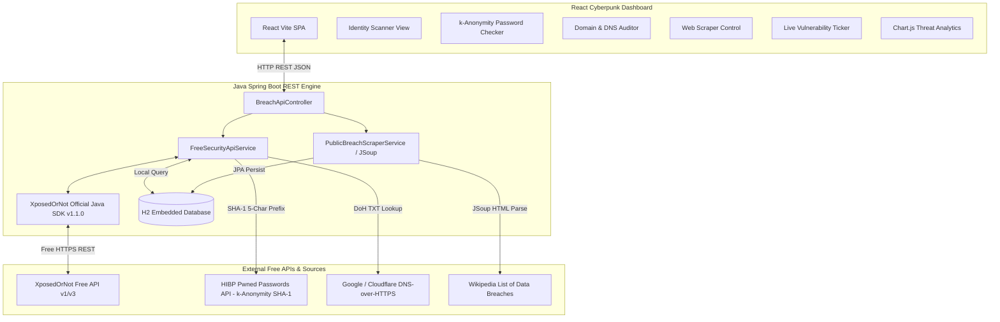

# AEGIS BREACH: SYSTEM ARCHITECTURE & TECHNICAL BLUEPRINT

## 1. System Overview

AegisBreach is a full-stack **Ethical Public Breach Monitoring Engine** designed to identify exposed credentials, vulnerable enterprise domains, and critical security disclosures using **XposedOrNot Official Java SDK (v1.1.0)**, **100% free public security APIs**, and an **ethical JSoup web scraping engine**.

---

## 2. Component Specifications

### 2.1 Java Backend Layer (Spring Boot 3.x)
- **Framework**: Spring Boot 3.2.3 (Java 17)
- **Official SDK**: `com.xposedornot` Java SDK v1.1.0 for free breach API operations
- **Database**: H2 In-Memory / Embedded Relational Database
- **Web Scraping Engine**: JSoup 1.17.2 for DOM parsing of public breach directories
- **Cryptography**: BouncyCastle 1.78.1 & Apache Commons Codec for SHA-1 digests
- **CORS Configuration**: Open cross-origin REST configuration for Vite dev server (`http://localhost:5173`)

### 2.2 Frontend Layer (React + Vite)
- **Build Tool**: Vite 5.1
- **UI Styling**: TailwindCSS + Custom CSS tokens (glassmorphism, cyber neon accents, animated grid background, scanlines)
- **Data Visualization**: Chart.js 4.4 + React-Chartjs-2
- **Icons**: Lucide React
